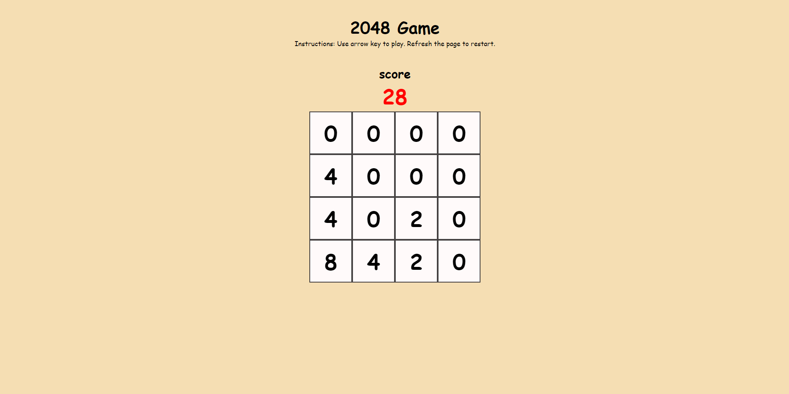

# 2048 Game

This project is a classic implementation of the 2048 game where players merge tiles with the same numbers to reach the elusive 2048 tile.

## Live Demo

You can play the 2048 Game online by visiting the following link:
[2048 Game](https://yashchinchole.github.io/2048/)

## Technologies Used

- HTML
- CSS
- JavaScript

## Features

- 4x4 grid of tiles that slide smoothly.
- Merge tiles with the same numbers by sliding them in any direction (up, down, left, or right).
- Score tracker to keep track of the player's current score.
- Game over detection when no more moves are possible.
- Smooth animations and intuitive gameplay.

## Screenshot

